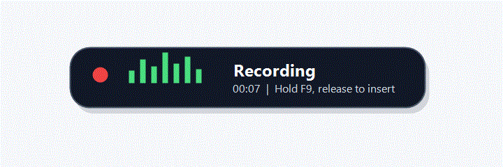

# VoiceTray

**Wispr Flow magic, 100% offline and free.**

VoiceTray is a Windows tray dictation app that lets you speak messily and inserts clean, ready-to-send text into the app you were already using. It runs local speech recognition with faster-whisper, keeps raw and cleaned dictations in local SQLite history, and never sends your voice or text to a cloud service during dictation.



## What You Get

- Hold `F9` to dictate into Notepad, VS Code, Chrome textareas, Slack, terminals, and most Windows input fields.
- Short-tap `F9` for hands-free lock mode; tap `F9` again or press `Esc` to stop.
- Use `F10` to capture a dictation into local History without typing into the foreground app.
- See a floating dictation pill with live microphone level, elapsed time, processing state, and brief error feedback.
- Browse raw vs cleaned dictations in History, copy or reinsert text, and add selected words to the personal dictionary.
- Configure hotkeys, autostart, cleanup modes, app profiles, dictionary, snippets, and models from the in-process Settings window.
- Stay offline at runtime: local STT, local cleanup rules, optional local GGUF cleanup model, local logs, and local history.

## Honest Comparison

VoiceTray aims for the feel of polished cloud dictation while taking the opposite privacy and pricing tradeoff.

| Capability | Wispr Flow | Typeless | VoiceTray |
|---|---|---|---|
| STT engine | Cloud OpenAI/Meta models, about 97% accuracy | Cloud STT with auto language detection | Local faster-whisper with `base`, `small`, and `medium` choices |
| Recording model | Hold-hotkey push-to-talk plus hands-free lock; 6-minute cap | Hold-hotkey push-to-talk | Hold-to-talk plus toggle lock mode; 10-minute soft cap |
| Filler removal | Automatic | Automatic | Rules plus optional local LLM cleanup |
| Backtrack and self-correction | Core feature | Core feature | Rule handling plus optional validation-guarded local LLM cleanup |
| Repetition removal | Yes | Yes | Yes |
| Auto punctuation and capitalization | Yes | Yes | Whisper plus cleanup rules |
| Spoken punctuation and new lines | Yes | Yes | Yes |
| Auto lists | Yes | Yes | Yes |
| App-specific tone | Styles and context | Tone presets | Per-app profiles for general, email, chat, notes, and code comments |
| Personal dictionary | Learns corrections | Yes | Local glossary with History-to-dictionary action |
| Snippets | Yes | No | Local snippet expansion |
| Command mode | Yes | No | Not in v1 |
| Code and IDE awareness | Strong | Limited | Conservative code/comments profile |
| Quiet speech | Supported | Not highlighted | Best-effort; use Windows input gain if needed |
| Languages | 100+ | 100+ with auto-detect | Whisper multilingual with language setting or auto |
| History | Dashboard | Yes | Local History window with raw/clean toggle |
| Privacy | Cloud dictation | Cloud dictation | 100% offline |
| Price | $15/mo | $12/mo | Free, open source |

## Install

### Packaged App

1. Run `tools\build.ps1` to create the one-folder Windows app.
2. Launch `dist\VoiceTray\VoiceTray.exe`.
3. The first-run wizard checks your microphone, downloads the selected Whisper model, and walks through the hotkey flow.

The packaged app keeps external assets and models beside the executable:

```text
dist\VoiceTray\VoiceTray.exe
dist\VoiceTray\assets\
dist\VoiceTray\models\
```

### From Source

```powershell
pip install -r requirements.txt
pythonw -m voicetray
```

Use `python -m voicetray` or `run_debug.bat` when you want a visible console and debug logs.

## Model Size Guidance

VoiceTray downloads models only when you choose them during onboarding or in Settings -> Models.

| Model | Size | Best For | Notes |
|---|---:|---|---|
| `base` | base (~145 MB) | Default daily dictation | Fast, good enough for most notes and chat, uses int8 compute |
| `small` | small (better accuracy) | More accurate writing and names | Slower than base; VoiceTray warns if it misses the local performance budget |
| `medium` | medium (best CPU-viable accuracy) | Highest local STT quality | Best for patient desktop CPUs; expect larger download and slower first use |

Optional cleanup tier: install a local GGUF runtime and point Settings -> Models at `Qwen2.5-1.5B-Instruct` `Q4_K_M` (~1 GB). VoiceTray validates local LLM edits and falls back to deterministic rules when an edit looks risky.

## Daily Use

1. Click where text should go.
2. Hold `F9`, speak, then release.
3. VoiceTray transcribes locally, cleans the text, writes raw and cleaned versions to History, and inserts the cleaned version into the focused app.

Long recordings warn at 9 minutes and stop at 10 minutes to keep memory bounded. If the focused app changes before insertion, VoiceTray skips unsafe typing and leaves the dictation in History.

## Tray Menu

- **Start Listening / Stop Listening** toggles global hotkeys.
- **History** opens the local raw/clean dictation browser.
- **Settings** opens hotkeys, cleanup, dictionary, snippets, models, autostart, and About.
- **Open Log Folder** opens `%LOCALAPPDATA%\VoiceTray\logs`.
- **Quit** exits the app.

## Local Files

- Config: `%LOCALAPPDATA%\VoiceTray\config.json`
- Logs: `%LOCALAPPDATA%\VoiceTray\logs\voicetray.log`
- History: `%LOCALAPPDATA%\VoiceTray\history.db`
- Packaged models: `dist\VoiceTray\models`

VoiceTray has no telemetry and no cloud fallback for dictation. Network access is only used for explicit model downloads that you start from onboarding or Settings.

## Troubleshooting

**No microphone**

- Check Windows microphone privacy permissions.
- Unplug and reconnect the device; VoiceTray retries the default input stream and shows a no-microphone tray state when needed.
- Open Settings after reconnecting if Windows changed the default input device.

**Hotkey does not respond**

- Confirm VoiceTray is running in the tray.
- Check Settings for a hotkey conflict.
- Try running as administrator if another elevated app has focus.

**Text does not insert**

- Click the target field again and retry.
- Check History; VoiceTray stores dictation before insertion so the text is still available.
- Some terminal or remote-desktop contexts may need the fallback typing path.

**Model download or first dictation is slow**

- Start with `base`.
- Use `small` only if accuracy matters more than latency on this machine.
- Keep `medium` for quality-sensitive work on faster CPUs.

## Development Checks

```powershell
$env:PYTHONDONTWRITEBYTECODE='1'
$env:QT_QPA_PLATFORM='offscreen'
python -B -m pytest tests\ -q
python -B -m voicetray.eval
python -B tools\soak.py --cycles 50 --target synthetic
```

## License

VoiceTray is free and open source.
